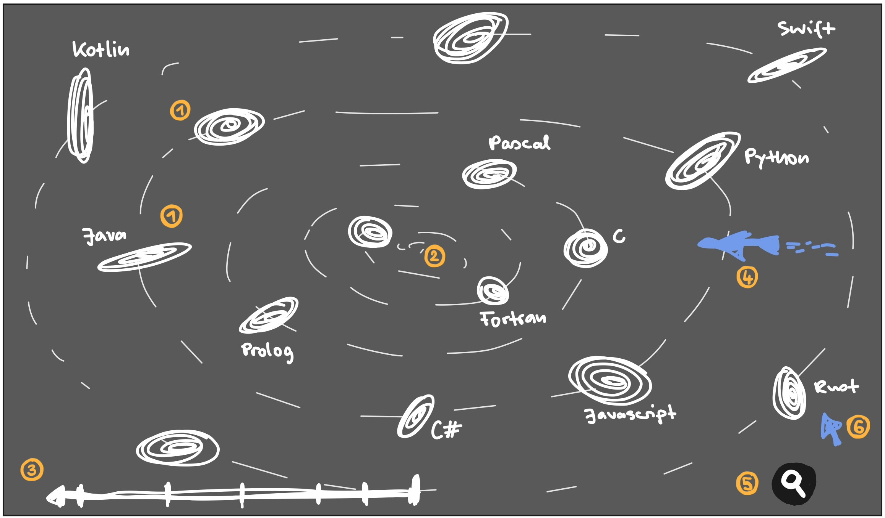
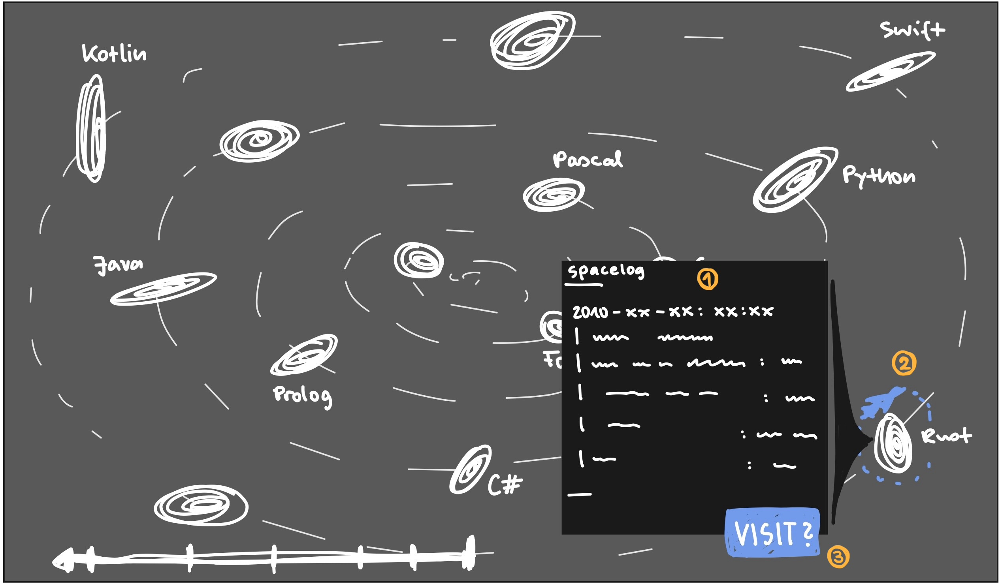
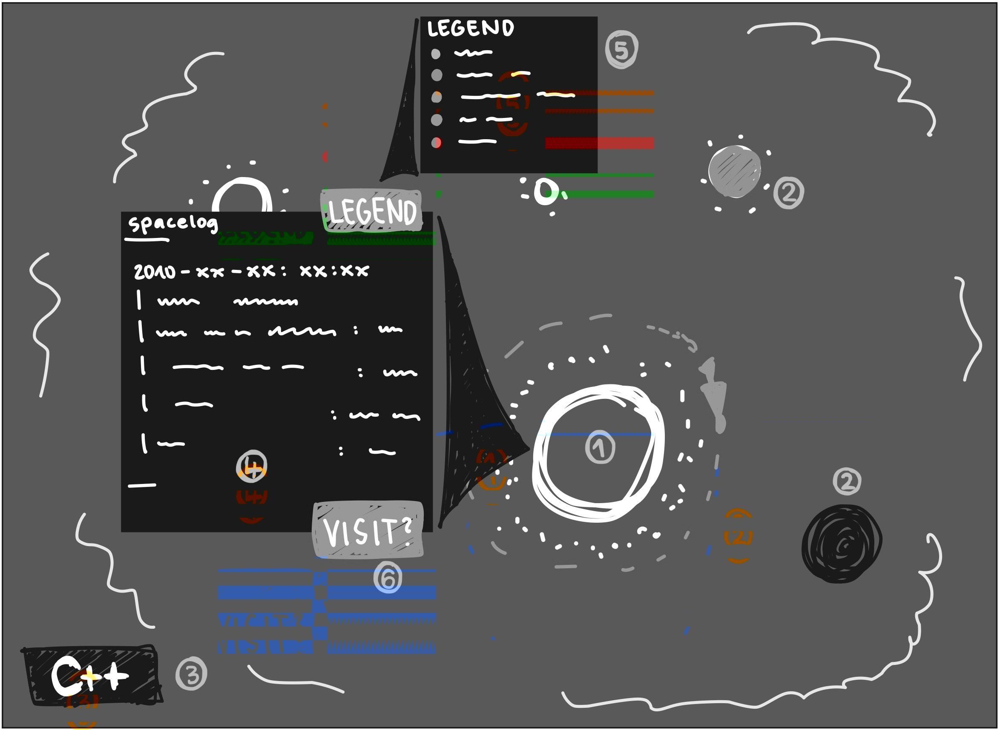
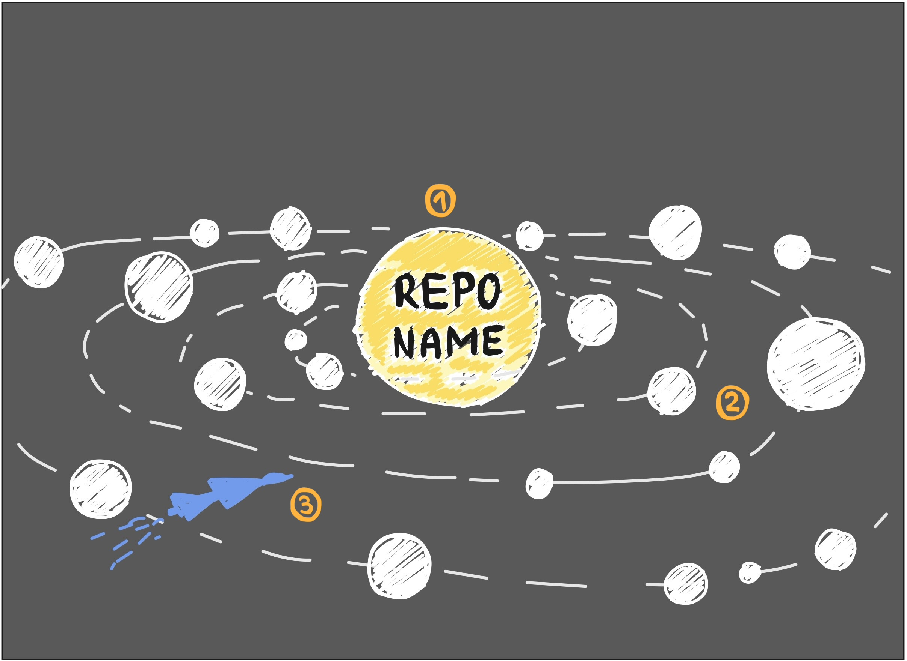

# Documentation (Designing and Conceptualizing a Data Storytelling Application) 
## General Introduction to the Topic  
A data story is a communication tool that combines three elements: data, visual forms, and a narrative component [^1]. For this technique, graphical elements get paired with written or auditory explanations to provide guidance throughout the analysis process of a topic and help with understanding. This approach connects quantitative evidence with qualitative narratives, making abstract or "cold" data more understandable, relevant, and accessible for non-experts [^2] [^3]. Data stories are an effective way to present complex information and inspire action [^1]. Usages of that can be found in many different fields. For example in the climate change communication [^1] [^2], in data analysis [^4], planning (like trips or theater rehearsals) [^5] or also supporting refugee families in coping with the loss of their homeland and identity through the sharing of memories [^6].

Data stories can be generated through a diverse array of media, ranging from traditional digital software to physical, embodied interfaces, that use robots to represent information. Since Large Language Models (LLMs) have become more popular, many modern versions of data story telling approches make use of such. LLMs are therefore used to plan animation scenes, interpret data, translate narrative text into commands for steering pysical robots [^5], generating pictures [^6] or the generation of whole narratives [^4].

  
## Task Definition

The goal of this project is to design and implement an interactive, explorable threedimensional (3D) data storytelling application titled *"The Search for Habitable Worlds"*. The application presents GitHub's open-source ecosystem as a navigable universe, built with Three.js, in which the user takes on the role of a space explorer searching for "habitable worlds" — thriving, actively maintained software projects.

The underlying dataset will be [ronantakizawa/github-top-projects](https://huggingface.co/datasets/ronantakizawa/github-top-projects) from Hugging Face, which contains approximately 423,000 entries of daily GitHub trending repositories from 2012 to 2024, including star counts, fork counts, rankings, and dates. Where necessary, this data is enriched via the GitHub REST API to obtain repository metadata such as primary programming language, description, and topics.

### Data-to-Space Mapping

The application maps GitHub data onto celestial objects using the following metaphor:

- **Galaxies** represent programming languages (e.g., Python, JavaScript, Rust, C). Their position within the universe encodes the age of the language: older languages (C, Fortran) are located toward the outer rim of the universe, while younger languages (Rust, Zig, TypeScript) are positioned closer to the center — a "Big Bang" point from which the universe expands outward over time. This spatial arrangement provides a natural narrative arc: the user's spaceship begins at the ancient outer edge and travels inward through progressively younger and more active galaxies.
- **Stars / Suns** within each galaxy represent individual repositories. Their size encodes the star count (GitHub stars), and their brightness or luminosity reflects recent trending activity (ranking frequency and recency).
- **Planets** orbiting a star represent notable forks or sub-projects of that repository.
- **Staleness of data** is encoded in the state of each sun: an actively trending repository appears as a bright main-sequence star, a repository that was once popular but has become inactive degrades into a red giant or white dwarf, and a repository that has been archived or abandoned collapses into a black hole.

### Narrative and Interaction Design

Following the storytelling concept *"The Search for Habitable Worlds,"* the application frames data exploration as a space expedition. A project is considered "habitable", if it is actively maintained, growing in popularity, and welcoming to contributors — analogous to a planet with the right temperature, atmosphere, and water. Concretely, the application provides:

- **User input:** The user can search for or select a specific project (star/planet) by name. The 3D scene supports mouse-based rotation and zoom via orbit controls. The user can click on any celestial object to initiate a camera fly-to animation, traveling through the universe toward the selected target.
- **Output — Visual:** Upon arrival at a star or planet, the application displays contextual information panels (text boxes) showing repository metadata such as name, description, star count, fork count, language, and trending history. Color coding is used to communicate key metrics (e.g., warm colors for highly active projects, cold blue tones for dormant ones).
- **Output — Audio (nice-to-have):** LLM-generated voice narration provides spoken summaries about each visited project, delivered in the style of a ship's log or mission briefing (e.g., *"Approaching star React in the JavaScript galaxy — 220,000 stars detected, high habitability index, last trending activity: 3 days ago"*).

### 3D Assets and Generation

Planet and star models are either procedurally generated within Three.js (e.g., sphere geometries with shader-based surfaces), sourced from free-to-use 3D asset libraries, or generated using AI image generation tools for textures. The application does not require photorealistic rendering; a stylized, visually coherent aesthetic is sufficient.

### Scope Boundaries

The following aspects are explicitly *not* part of this project:

- Real-time synchronization with live GitHub data (the application uses a static snapshot of the dataset, optionally enriched once via API).
- Multi-user collaboration or shared exploration sessions.
- Training or fine-tuning of custom machine learning models (existing LLM APIs are used for narrative generation).
- Support for datasets beyond GitHub repositories (the application is designed for this specific dataset and metaphor).
- A comprehensive summative user study (a small formative evaluation with 3–5 participants is planned to validate the concept).
- Applications in the medical domain.

## Requirements

The following requirements are categorized using the MoSCoW method [^7].

**Must Have:**
- A 3D explorable universe rendered in the browser using Three.js, containing galaxies (programming languages), stars (repositories), and planets (forks).
- Spatial encoding of language age via galactic position (older languages at the outer rim, younger languages near the center).
- Visual encoding of repository metrics: star count mapped to sun size, trending recency mapped to brightness/luminosity, and data staleness mapped to celestial state (main-sequence star, red giant, white dwarf, black hole).
- Interactive camera fly-to animation when the user selects a celestial object.
- Mouse-based orbit controls (rotation, zoom, pan) for scene navigation.
- Contextual information panels displaying repository metadata (name, description, stars, forks, language, trending history) upon selection.
- Color coding of celestial objects to communicate activity level (warm = active, cold = dormant).
- Data pipeline that loads and preprocesses the github-top-projects dataset from Hugging Face.

**Should Have:**
- A search function allowing the user to find and navigate to a specific repository by name.
- Enrichment of the dataset with programming language and description metadata via the GitHub REST API.
- A guided narrative mode that flies the user through the universe along a predefined story path (e.g., from the outer rim inward, visiting notable stars).
- Procedurally generated or AI-generated textures for planets and stars to visually differentiate categories.

**Could Have:**
- LLM-generated textual descriptions for repositories, presented in information panels as narrative summaries.
- Voice narration (text-to-speech) delivering spoken mission briefings about visited projects.
- Animated orbital mechanics for planets around their parent stars.
- Visual representation of trending "supernova" events (repositories that gained massive popularity in a short time).
- Background ambient soundscape to enhance immersion.

**Won't Have:**
- Real-time live data synchronization with GitHub.
- Support for multiple concurrent users or collaborative exploration.
- Custom-trained machine learning models.
- Support for non-GitHub datasets.
- A full summative user study (only a small formative evaluation is planned).

[^7]: D. Clegg and R. Barker, *Case Method Fast-Track: A RAD Approach*. Boston, MA: Addison-Wesley, 1994.
  
## Structure  
The project is divided into modular work packages (WPs) that reflect the main system components: data processing, 3D visualization, interaction, narrative layer.

### WP0 - Literature Review & Catalogue Preparation
**Goal:** 

**Outputs:** 
- Brief catalogue of current tools for data storytelling

**Tasks:**
- Research about data storytelling
- Provide catalogue with tool name, uses, domain, interaction, technology, design, goal, shortcomings and link

**Dependencies:** none

### WP1 - Data Acquisition & Preprocessing
**Goal:** Prepare the dataset for usage

**Tasks:**
- Load dataset from Hugging Face (github-top-projects)
- Clean and normalize data if needed (duplicates, ...)
- Optional: Enrich via GitHub REST API (language, description, topics)
  
**Outputs:**
- Structured dataset
  
**Dependencies:** none

### WP2 - Data Modeling & Mapping
**Goal:** Translate data into space metaphor

**Tasks:**
- Definitions for mapping rules:
  - Language → galaxy
  - Repository → star
  - Fork → planet
- Encoding of attributes:
  - Star size = star count
  - Brightness = trending activity
  - Position = language age
  - State = staleness (active → black hole)
- Computation of spatial coordinates
  
**Output:**
- Data model for rendering (scene-ready objects)
  
**Dependencies:** WP1 (conceptual design is independent)

### WP3 - 3D Scene & Rendering
**Goal:** Build the visual universe

**Tasks:**
- Rendering of galaxies, stars, planets
- Implementation of visual encodings (size, color, brightness)
- Addition of shaders or textures
  
**Outputs:**
- Rendered 3D universe
  
**Dependencies:** WP2 (basic setup can start earlier)

### WP4 - Interaction & Navigation
**Goal:** Enable user exploration

**Tasks:** 
- Orbit controls (zoom, rotate, pan)
- Object selection (raycasting)
- Scene navigation logic
  
**Output:**
- Interactive exploration system
  
**Dependencies:** WP3

### WP5 - Information Interface 
**Goal:** Display repository details

**Tasks:**
- Design info panels (HTML/CSS overlay)
- Show metadata:
  - Name, description
  - Stars, forks
  - Language, history
- Apply color coding (activity levels)
  
**Output:**
- UI with contextual information
  
**Dependencies:** WP4 (UI design can start earlier)

### WP6 - Narrative & Storytelling
**Goal:** Guided exploration and storytelling

**Tasks:**
- Define narrative path (outer → inner universe)
- Implement guided tour mode
- Generate textual summaries (LLM)
- Optional: voice narration 
  
**Outputs:**
- Narrative experience
  
**Dependencies:** WP5

### WP7 - Visual Enhancements & Effects (Optional)
**Goal:** Improved immersion

**Tasks:**
- Procedural textures for stars/planets
- Orbital animations
- Supernova effects (trending spikes)
- Ambient background (optional audio)
  
**Outputs:** 
- Enhanced visual quality
  
**Dependencies:** WP3

### WP8 - Documentation
**Goal:** Complete documentation of the project

**Tasks:**
- Describe system architecture and design decisions
- Document data pipeline and preprocessing steps
- Explain data-to-space mapping and visual encodings
- Describe interaction design and user interface
- Document implementation details (Three.js, APIs, libraries)
- Summarize narrative concept and storytelling approach
- Provide setup and usage instructions

**Outputs:**
- Final written report (project documentation)
- Technical documentation (code structure, components)

**Dependencies:** All previous WPs (report can be done partially)

  
## Time plan

The project duration spans from 07.05.2026 to 21.07.2026. The work is divided into structured phases to ensure steady progress and timely delivery.

### Phase 1: Planning & Research
- Finalize project idea and scope
- Review related work, datasets, and tools
- Define system architecture and requirements

### Phase 2: Design
- Design system components and workflows
- Define data structures and interfaces
- Create initial UI/UX sketches

### Phase 3: Core Implementation
- Develop main functionalities
- Implement core algorithms
- Integrate basic system components

### Phase 4: Integration & Advanced Features
- Combine all modules into a working system
- Add optional and advanced features
- Improve performance and usability

### Phase 5: Testing & Debugging
- Perform functional testing
- Fix bugs and optimize system behavior
- Validate results against requirements
### Phase 6: Finalization & Submission
- Prepare documentation and report
- Final code cleanup and polishing
- Prepare presentation

The following chart shows an overview of the time periods each phase is planned to take up.

## UI concept and sketches

As described before, the user interface (UI) will be a threedimensional world resembling a universe in space, which the user can travel through. The UI will be split into three main views. The user can travel between these views via mouse controls. Upon view change,  a fly-to-animation will be triggered and played to load the new scene to provide a seamless experience for the user. 

### Universe view

The data storytelling journey will start in the 'universe view'. Within this universe, every programming language is represented as its own galaxy (1). The further away from the center of the universe (2), the younger the language is. To give an overview of how old each language is, this view will contain a simple timeline (3). There was also the idea of creating galaxy-like images out of the logos of the respective programming languages. This could enhance the visual overview and help the user with finding a programming language they're interested in 'visiting'. 
The user can travel through the space with a spaceship (4) and can visit all different galaxies. Additionally, the UI will contain a mouse pointer (6), with whom the user can click upon galaxies to select or deselect them. 
In case the user wants to find a certain programming language, repository or fork, they can search for that via a search bar (5). In this sketch the bar is just placed in the bottom right corner of the screen. However, the team has been brainstorming about other ideas, such as placing it inside the spaceship to help with immersion rather than recreating the feeling of a typical web search function. 

Upon selecting a specific programming language, a dialogue window opens next to the galaxy (1). This will display the most important information about the programming language, provided by the llm model. The text will be generated in a spaceship log style to support the narrative. Within this selection mode, the spaceship will orbit around the galaxy (2), highlighting the users current position. The dialogue window also contains a button to enter the galaxy via selection (3). If clicked, another fly-to-animation will be triggered and the user will be transported to the next view, which will then be the galaxy view. 

### Galaxy view

This second view will display all repositories, whose main programming language is the one selected beforehand. Within this view every star or sun represents one github repository, while the orbiting plane represent relevant forks or sub projects of each repository (1). The size and color also encode different data concerning the "habitability" of the galaxy, for example black holes marking archived or abandoned repositories and red suns showing currently inactive projects (2). To keep in mind what programming language is currently selected, the idea was to place a simple box with the name in the lower left corner (3). However, the team is not yet satisfied with this idea and therefore will continue to elaborate on that. 
Similar to the universe view, the user can select a sun or star by clicking with the mouse, which will open a dialogue window displaying important information narrated by the llm model in a ship log style (4). Since this information will be color coded to signal which repositories might be more or less habitable, the user will have the possibility to open a legend (5) to get an overview and a bettter understanding of the encoded information. Furthermore, this view will also contain the possibility to travel to a selected repository by clicking on a button in the dialogue window (6). 

### Solar system view

In this view, the selected repository will be displayed as a sun or star in the middle of a solar system (1), having important forks or sub projects orbiting around them (2). Similar to the other two views, the user can move around the space via controlling the spaceship (3) and/or clicking on specific forks/projects. Upon clicking, a dialogue window will open, just like in the other views explained above. 

## Current implementation state
### Data
For the data, we first downloaded a dataset from hugging Face as a CSV file format. Then we imported it into a SQLite database to provide a structures, queryable foundation for the data. Because we needed additional information like the primary programming language and the repository description we enriched the existing data using the GitHub API. We supplement each record with the additional data. 
To make the data in the database easily accessible and usable we developed a REST API with multiple endpoints. Each endpoint serves a specific purpose. To the whole API can easiliy be added new endpoints.

## Frontend
We have already implemented the spaceship and a base frame of the solar system for the frontend. The spaceship can be controlled using the mouse. You can board and steer the ship.

### Literature Research
For the catalogue, we started by reading several papers and collecting them in an Excel spreadsheet. We summarised the content of the different papers by filling in the columns of the table. The columns are: Use case, domain, interaction, used technologies, goal and shortcomings. Currently, we have completed half of our literature research goal.
  
## Work distribution

The project will be carried out collaboratively by all four team members, with a flexible and adaptive work distribution that may evolve as the project progresses and individual strengths become clearer.

At this stage, responsibilities are not strictly fixed. Instead, the team will follow a shared ownership approach, where all members contribute to the core phases of the project:

- **Research & Literature Review**: All members will participate in exploring related work, tools, and datasets.
- **Design**: System architecture, component design, and planning will be done collaboratively.
- **Implementation**: Development tasks will be distributed dynamically based on progress, complexity, and individual expertise.
- **Testing & Debugging**: All members will be involved in validating the system and improving reliability.
- **Documentation**: The project report and documentation will be written jointly and reviewed by all team members.

As the project progresses, task specialization may naturally emerge, and responsibilities can be adjusted accordingly to improve efficiency and ensure balanced workload distribution.

Regular team meetings will be held to:

- Track progress
- Assign short-term tasks
- Resolve blockers
- Ensure equal contribution from all members

[^1]: J. L. Pardo u. a., „One Dataset – Three Stories: Data Storytelling for Climate Change Awareness“, in 2023 27th International Conference Information Visualisation (IV), Juli 2023, S. 194–197. doi: 10.1109/IV60283.2023.00042.
[^2]: E. Mencarini, C. Leonardi, P. Massa, und F. D’Errico, „Stories from the Peaks: An Interactive Data Storytelling to Narrate Climate Change Impacts through a Pluralism of Voices“, in Proceedings of the 16th Biannual Conference of the Italian SIGCHI Chapter, in CHItaly ’25. New York, NY, USA: Association for Computing Machinery, Okt. 2025, S. 1–8. doi: 10.1145/3750069.3750130.
[^3]: Marta Ferreira, Nuno Nunes, Pedro Ferreira, Henrique Pereira, and Valentina Nisi. 2024. Connecting audiences with climate change: Towards humanised and action-focused data interactions. International Journal of Human-Computer Studies 192 (2024), 103341. https://doi.org/10.1016/j.ijhcs.2024.103341
[^4]: H. W. Wang, L. Birnbaum, und V. Setlur, „Jupybara: Operationalizing a Design Space for Actionable Data Analysis and Storytelling with LLMs“, in Proceedings of the 2025 CHI Conference on Human Factors in Computing Systems, in CHI ’25. New York, NY, USA: Association for Computing Machinery, Apr. 2025, S. 1–24. doi: 10.1145/3706598.3713913.
[^5]: R. Wang, S. Li, P. Zhang, D. Huang, Y. Guo, und H. Mi, „From Text to Movement: LLM-driven Swarm User Interfaces for Embodied and Interactive Storytelling“, in Proceedings of the 31st International Conference on Intelligent User Interfaces, in IUI ’26. New York, NY, USA: Association for Computing Machinery, März 2026, S. 1085–1099. doi: 10.1145/3742413.3789128.
[^6]: P. Song, A. Yadav, und D. Vyas, „Ambiguous Loss: Facilitating Refugee Families’ Sense of Home through AI-Powered Storytelling“, in Proceedings of the 2026 CHI Conference on Human Factors in Computing Systems, in CHI ’26. New York, NY, USA: Association for Computing Machinery, Apr. 2026, S. 1–17. doi: 10.1145/3772318.3791368.

